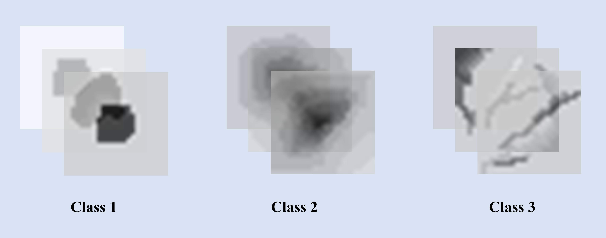

# Training of imaginary 2D grayscaled geological patterns
Training of imaginary 2D grayscaled geological patterns using a Convolutional Neural Network based model 

Class 1 patterns are imaginary artefacts

Class 2 patterns are imaginary peaks

Class 3 patterns are imaginary flat (planar) areas

Run the script `train_model.py` to train a model using the images in the directories `class1`, `class2` and `class3`. 

Then run the script `test_images.py` to test the trained model with the images in the folder named `test_images`.
